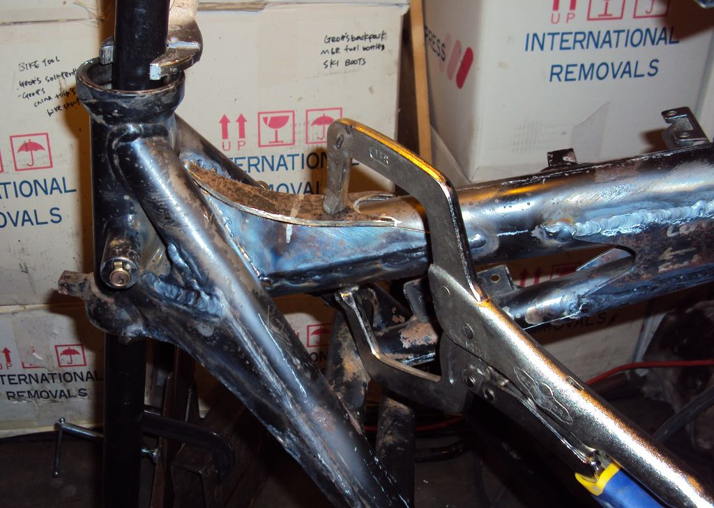
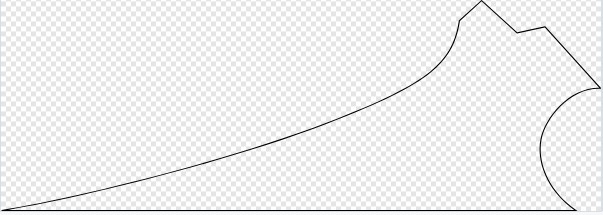

# bmw-frame-gussets

Scalable Vector Graphics files for gussets to reinforce the frame of BMW R100GS motorcycles.

## Licence & Usage

All files in the [bmw-frame-gussets Project](https://github.com/moto-design/bmw-frame-gussets), unless
otherwise noted, are covered by the
[Fabricators Design License](https://github.com/moto-design/bmw-frame-gussets/blob/master/fabricators-design-license.txt).
The text of the license describes what usage is allowed.
